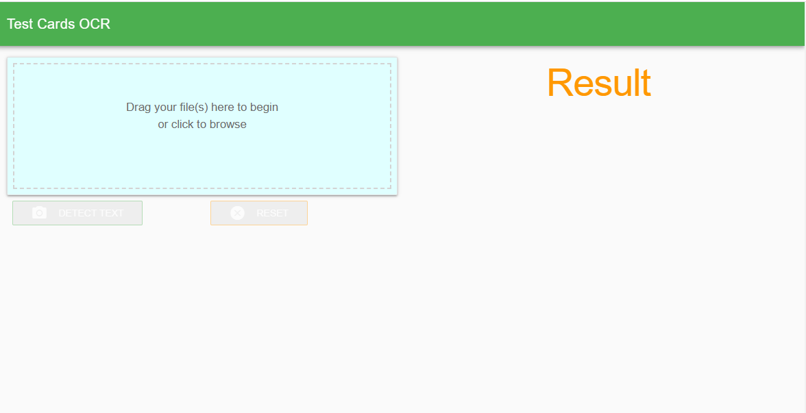
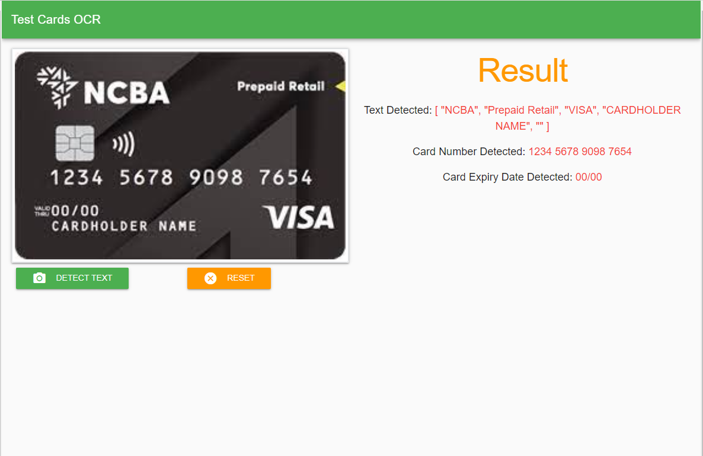
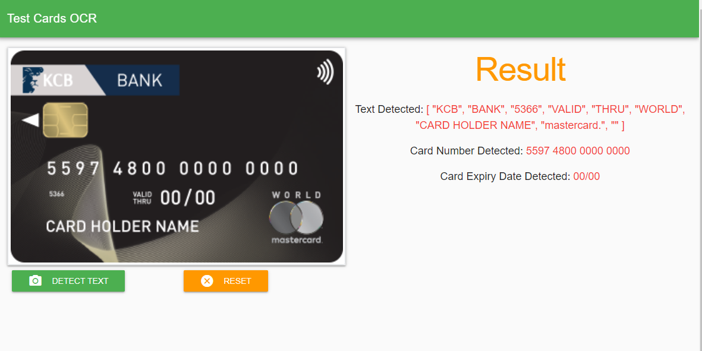
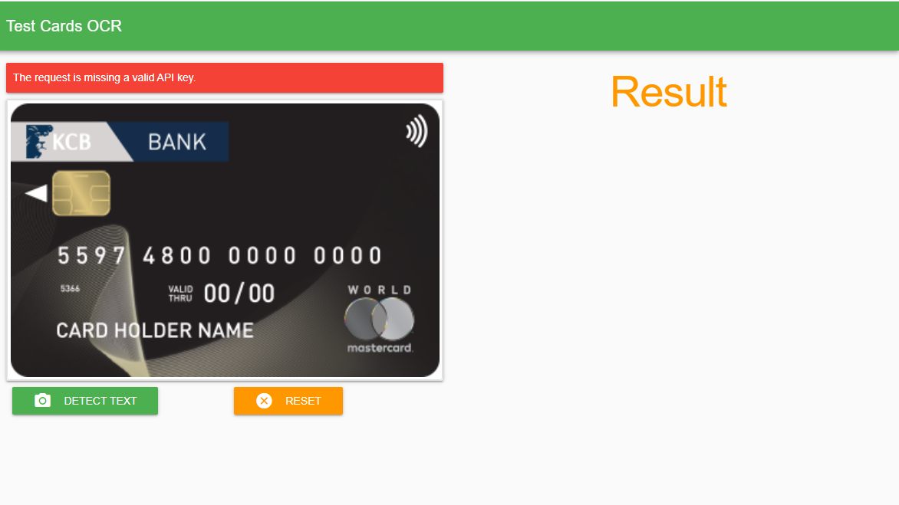

# Credit Card OCR/Detect Text Example

> Vue2 + Vuetify + Google Cloud vision api as a Progressive Web App

## Example


| Initial Form Screen                         |
|:--------------------------------------------|
|  |


| Credit Card Detected Text Success Screen   |
|:-------------------------------------------|
|  |


| Credit Card Detected Text Success Screen     |
|:---------------------------------------------|
|  |


| Credit Card Detected Text Error Screen           |
|:-------------------------------------------------|
|  |


## Getting Started

#### Create the Google API Key

Follow the instructions on how to create Google API Key for your project(https://cloud.google.com/docs/authentication/api-keys). This will
help in authenticating your requests.

Please make sure to copy your key and keep it secure.

##### Enable Google Cloud Vision api

> You must enable the Vision API for your project. For more information on enabling APIs, see the [Service Usage documentation](https://cloud.google.com/service-usage/docs/enable-disable).

At -> config/dev.env.js and -> config/prod.env.js, Replace 'GOOGLE_API_KEY' with key from [Google Cloud Api Browser Key](https://console.cloud.google.com/apis/dashboard)

``` bash
 GOOGLE_API_KEY: "Google Cloud Api Browser Key"
```

## Build Setup

### NPM
``` bash
# install dependencies
npm install

# serve with hot reload at localhost:8080
npm run dev

# build for production with minification
npm run build
```
### Yarn
``` bash
# install dependencies
yarn install

# serve with hot reload at localhost:8080
yarn dev

# build for production with minification
yarn build
```


